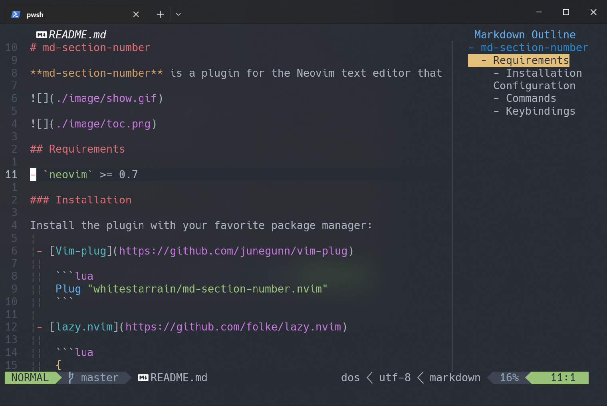

# md-section-number

**md-section-number** is a plugin for the Neovim text editor that allows you to automatically add and update heading levels for header numbers in Markdown files. This is especially useful for those writing long markdown documents with multiple levels of headers.




## Requirements

- `neovim` >= 0.7

### Installation

Install the plugin with your favorite package manager:

 - [Vim-plug](https://github.com/junegunn/vim-plug)

    ```lua
    Plug "whitestarrain/md-section-number.nvim"
    ```

 - [lazy.nvim](https://github.com/folke/lazy.nvim)

    ```lua
    {
        "whitestarrain/md-section-number.nvim",
        ft = "markdown",
        config = function()
            require("md_section_number").setup()
        end
    }
    ```

## Configuration

This plugin comes with the following defaults:

```lua
{
    max_level = 4, -- stop to add section number after max_level
    min_level = 1, -- start to add section number after min_level
    ignore_pairs = { -- the markdown content in these pairs will be ignored
        { "```", "```" },
        { "\\~\\~\\~", "\\~\\~\\~" },
        { "<!--", "-->" },
    },
    toc = { -- toc sidebar config
        width = 30,
        position = "right",
        indent_space_number = 2,
        header_prefix = "- ",
    },
}
```

### Commands

| Command          | Description                            |
| ---------------  | -------------------------------------- |
| `:MdClearNumber` | Delete all the header level numbers.        |
| `:MdUpdateNumber`| Add or update all the header level numbers. |
| `:MdHeaderDecrease`| Decrease a header level.                  |
| `:MdHeaderIncrease`| Increase a header level.                  |
| `:MdTocToggle`   | View the table of contents.                 |

### Keybindings

* For the table of contents:
    * `r` - Update.
    * `q` - Quit.
    * `enter` - Jump.

