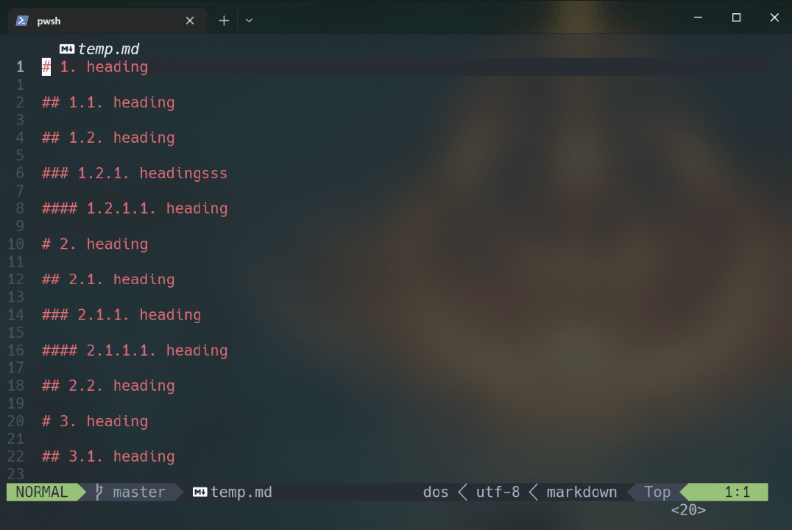

# md-section-number

**md-section-number** is a plugin for the Neovim text editor that allows you to automatically add and update heading levels for header numbers in Markdown files. This is especially useful for those writing long markdown documents with multiple levels of headers.




## Requirements

- `neovim` >= 0.7

### Installation

Install the plugin with your favorite package manager:

 - [Vim-plug](https://github.com/junegunn/vim-plug)

    ```lua
    Plug "whitestarrain/md-section-number.nvim"
    ```

 - [lazy.nvim](https://github.com/folke/lazy.nvim)

    ```lua
    {
        "whitestarrain/md-section-number.nvim",
        ft = "markdown",
        config = function()
            require("md_section_number").setup()
        end
    }
    ```

## Configuration

This plugin comes with the following defaults:

```lua
{
    max_level = 4, -- stop to add section number after max_level
    min_level = 1, -- start to add section number after min_level
    start_section_number = 1, -- section number start from this number (default: 1)
    start_subsection_number = 1, -- sub-level section numbers start from this number (default: 1)
    remove_trailing_dot = false, -- remove trailing dot from section numbers (default: false)
    ignore_pairs = { -- the markdown content in these pairs will be ignored
        { "```", "```" },
        { "\\~\\~\\~", "\\~\\~\\~" },
        { "<!--", "-->" },
    },
    toc = { -- toc sidebar config
        width = 30,
        position = "right",
        indent_space_number = 2,
        header_prefix = "- ",
        toc_level = 6,
    },
}
```

### Key Options

- `max_level` and `min_level`: Control which header levels get numbered
- `start_section_number` and `start_subsection_number`: Set starting numbers
- `remove_trailing_dot`: Remove trailing dots from section numbers
- `ignore_pairs`: Content blocks to exclude from numbering

### Configuration Examples

#### Basic Setup

```lua
require("md_section_number").setup({
    min_level = 1,
    max_level = 3,
    remove_trailing_dot = true,
})
```

#### Custom Starting Numbers

```lua
require("md_section_number").setup({
    start_section_number = 0,
    start_subsection_number = 1,
})
```

#### With TOC Customization

```lua
require("md_section_number").setup({
    max_level = 3,
    toc = {
        width = 40,
        position = "left",
        header_prefix = "• ",
        toc_level = 3,
    },
})
```

#### Custom Ignore Patterns

```lua
require("md_section_number").setup({
    ignore_pairs = {
        { "```", "```" },
        { "\\~\\~\\~", "\\~\\~\\~" },
        { "<!--", "-->" },
        { "{{", "}}" },
    },
})
```

### Commands

| Command          | Description                            |
| ---------------  | -------------------------------------- |
| `:MdClearNumber` | Delete all the header level numbers.        |
| `:MdUpdateNumber`| Add or update all the header level numbers. |
| `:MdHeaderDecrease`| Decrease a header level.                  |
| `:MdHeaderIncrease`| Increase a header level.                  |
| `:MdTocToggle`   | View the table of contents.                 |

### Keybindings

* For the table of contents:
    * `r` - Update.
    * `q` - Quit.
    * `enter` - Jump.
    * header's max display level
      * `h` - reduce header's max display level.
      * `l` - increase header's max display level.
      * `W` - Collapse all.
      * `E` - Expand all.

