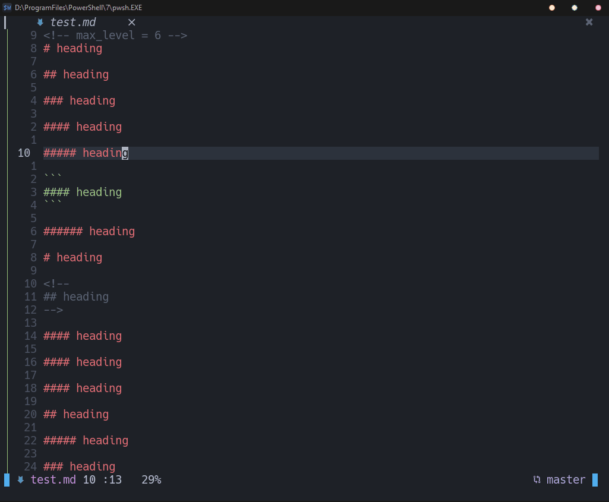

# Example



# About

A plugin to update heading number for markdown

# Requires

- `neovim`>=0.7

# Install

- vim-plug

  ```
  Plug 'whitestarrain/md-section-number.nvim'
  ```

# SetUpp

```lua
require("md_section_number").setup({
--[[
  max_level = 4,
  ignore_pairs = {
    { "```", "```" },
    { "\\~\\~\\~", "\\~\\~\\~" },
    { "<!--", "-->" },
  },
]]
})
```

# Use

- `:MDClearNumber`
- `:MDUpdateNumber`

